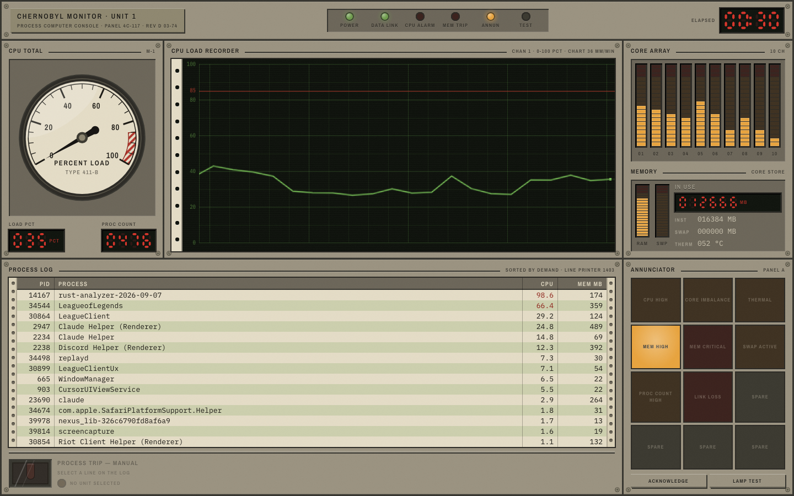

# Nuclear Monitor

A system monitor that pretends it is a 1974 reactor control room.

It shows you the same things Activity Monitor does — CPU, per-core load, memory,
swap, temperature, running processes — except it reads them off painted analog
gauges, backlit annunciator tiles and a scrolling paper strip chart, and you
kill a process by flipping up a hinged safety cover and throwing a red toggle.



## Install

Grab a build from the [latest release](https://github.com/jorgeortiz41/chernobyl-monitor/releases/latest).

| Platform | File |
|---|---|
| macOS (Apple silicon) | `*_aarch64.dmg` |
| macOS (Intel) | `*_x64.dmg` |
| Windows | `*_x64-setup.exe` or `*_x64_en-US.msi` |
| Linux | `*_amd64.deb` or `*_amd64.AppImage` |

**The macOS builds are unsigned**, so Gatekeeper blocks the first launch.
Right-click the app and choose *Open*, or clear the quarantine flag:

```bash
xattr -cr "/Applications/Chernobyl Monitor.app"
```

## The panel

| Instrument | Reads |
|---|---|
| Sweep gauge | Total CPU, 0–100%, with a red hatched danger arc from 85 |
| Strip chart recorder | CPU history on gridded paper, scrolling right to left |
| Core array | One bargraph column per logical core |
| Core store | RAM and swap columns, memory in MB, hottest sensor in °C |
| Annunciator | 12 alarm tiles — dark when clear, flashing at 1 Hz in alarm, steady once acknowledged |
| Process log | Every process, sorted by CPU, on greenbar line-printer stock |
| Guarded switch | Process kill. Raise the cover, then throw the toggle |

### Alarms

| Tile | Trips when |
|---|---|
| `CPU HIGH` | Total CPU ≥ 85% |
| `CORE IMBALANCE` | Busiest core exceeds quietest by ≥ 60 points |
| `THERMAL` | Hottest sensor ≥ 85 °C |
| `MEM HIGH` / `MEM CRITICAL` | Memory in use ≥ 75% / ≥ 90% |
| `SWAP ACTIVE` | Swap ≥ 10% used — a bare "> 0" would sit lit forever on macOS |
| `PROC COUNT HIGH` | ≥ 700 processes — macOS idles near 500 |
| `LINK LOSS` | No sample from the backend |

`ACKNOWLEDGE` latches a flashing tile steady. A tile that clears and trips again
re-flashes, so an acknowledged alarm never hides a new one. `LAMP TEST` lights
every tile while held.

### Killing a process

Select a row, click the safety cover to raise it, then click the toggle. That
sends `SIGTERM`. If the process is still listed on the next sample the switch
re-arms and a second, explicit throw escalates to `SIGKILL` — the escalation is
never automatic.

## Development

Requires [Bun](https://bun.sh) and the [Tauri prerequisites](https://tauri.app/start/prerequisites/).

```bash
bun install
bun run tauri dev
```

```bash
bun run build                      # typecheck + bundle the frontend
cd src-tauri && cargo test         # backend contract tests
python3 assets/make_icon.py        # regenerate the app icon
```

## How it is put together

The Rust side owns a long-lived `sysinfo::System` and samples it on a background
thread once a second, emitting a `system-stats` event. CPU usage is a difference
between two samples, so the reader has to persist across ticks — rebuilding it
per request is what forces the naive version to sleep inside the call.

```
src-tauri/src/monitor.rs   sampling, the SystemStats contract, process kill
src-tauri/src/lib.rs       Tauri commands + the sampler thread

src/types/system.ts        the same contract, camelCase
src/data/                  the only place that imports @tauri-apps
src/lib/alarms.ts          stats -> which tiles are lit
src/components/chassis/    plates, screws, lamps, nameplate
src/components/instruments/  the seven instruments
src/components/panels/     one file per region of the console
src/styles/console.css     design tokens and material rules
```

Every component is presentational: it takes data through props and emits intent
through callbacks. Nothing below `src/data/` knows Tauri exists, which is why
the instruments can be rendered against any source.

## Design notes

The palette is warm and desaturated because in 1974 the light came from
incandescent filaments, not LEDs. There is no blue anywhere. Panels have zero
border-radius and hard-edged shadows; radius exists only on lamps and switch
caps. Unlit lamps and the dark segments of every seven-segment digit are always
drawn — a display that only renders its lit segments is the fastest way to look
fake.

Under `prefers-reduced-motion` the alarm flash stops and tiles hold steady lit,
and the chart advances in discrete jumps instead of scrolling.

## License

MIT
